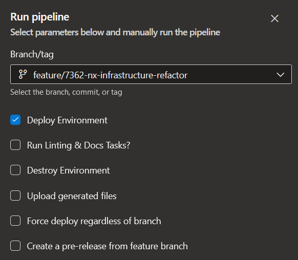

== Azure DevOps Features

In order to test, run and operate efficiently, a few feature switches have been added to the AzureDevOps GUI when running a pipeline manually (of course these can be remotely toggled via sending the parameter name along with a true/false when sending an HTTP request to the pipeline).

.Azure DevOps Feature Switches

==== Deploy Environment

This feature is required to ensure that the infrastructure and application image are built and deployed, as specified by the code. If this flag is not true, your infrastructure and application will not be configured. This is useful for when you wish to test, or run features added to your pipelines without constantly having to run stages you do not intend to test.

==== Run Linting & Docs Tasks?

This feature allows you to determine whether you run the code lint and validation tests as well as generate pdf documentation. You may wish to avoid this when testing new features, as it takes a few minutes to run and you might not care about output of documentation or correct code formatting whilst troubleshooting or testing features.

==== Destroy Environment

The destroy environment flag will delete the infrastructure associated with your deployment, without this, you wouldn't be able to take advantage of the terraform destroy feature to control your deployed resources. Do not tick this if you aren't intending to destroy the infrastructure associated with this pipeline.

==== Upload Generated Files

This will upload your pdfs to GitHub via a release, allowing for seamless integration and easy documentation provided by adoc automation.

==== Force Deploy Regardless of Branch

This will supercede any rules within the pipeline that protects production environments. You may wish to use this flag to quickly hotfix a problem in production in a serious event/incident where you cannot get PR/Merge approval quickly. It would not be wise to use this routinely as best practice would suggest to routinely merge your code to your main trunk and deploy from there.

==== Create a pre-release from feature branch

Allows you to generate a release version of the code, to ensure that it can be referenced and published even if it isnt the main/master branch.
