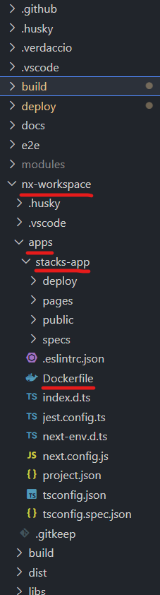

== Application Build & Deploy

These stages occur after the initial deploy, it is required to have ran your infrastructure task/stage if you wish to utilise Redis Cache in your application, as the secret will be exposed within the application as an environment variable, `REDIS_CONNECTION_STRING`.

=== Build
==== [.underline]*Contextual Overview*
This is a simple build stage with a few processes, the code looking like the following:

.Application Build Task
image::images/app_build_task.png[]

From your calling pipeline or within your terminal a variable set as `$app_workspace` should exist, allowing for the build task to set itself to the environment your frontend application will reside. It is important that this is set or your application will not build correctly, the build directories set out within the `root/build/azDevOps/azure/pipeline-vars.yml` will show you the default expected build arguments, for a project that looks like this:

```
- name: app_workspace
  value: nx-workspace
- name: app_directory
  value: ./apps/stacks-app/Dockerfile
```

.Example source code for application build


==== [.underline]*Process to Build*

Using Taskctl to direct to tasks and its underlying Ensono Independent Runner PowerShell modules, the process to build simply requires a few input variables to perform a basic build. This will call to your *Azure Container Registry* (*ACR*), *Elastic Container Registry* (*ECR*), or *Docker Registry* (*DR*). It will perform a login using your authentication credentials, and then Docker Build, Tag and Push to your desired endpoint, publishing your application image. This will then be referenced in the following Deploy Step/Task.

=== Deploy
==== [.underline]*Contextual Overview*
This task utilises a few scripts to keep the taskctl tasks simple and easy to read. The scripts are located within the `root/build/scripts` directory and contain various supporting scripts for the deployment task as well as others.

.Application Deploy Task


The scripts it calls to are:

- *_Prepare-TerraformOutputs_* - a script to remove the logic of fetching terraform outputs from state or via terraform init/plans
- *_Deploy-Secret_* - This ensures that a secret is deployed to the K8s cluster ONLY if the `$create_redis` variable has been set to true
- *_Deploy-Manifests_* - This deploys standard K8s manifests to the K8s cluster to deploy a simple frontend application, using the image generated in the step above. These manifests can be located in `root/deploy/app` and will need you to tweak their content to ensure that the correct endpoint is exposed via ingress, as well as the correct image is used for the deployment.

Each of the above scripts will use environment variables which SHOULD be present within your terminal session, or dictated by your `root/build/azDevOps/azure/pipeline-vars.yml` variable delcarations within your pipeline. Ensure you are passing the correct environment variables into this task at the `deploy-infrastructure.yml` level or the environment variables will not exist.
