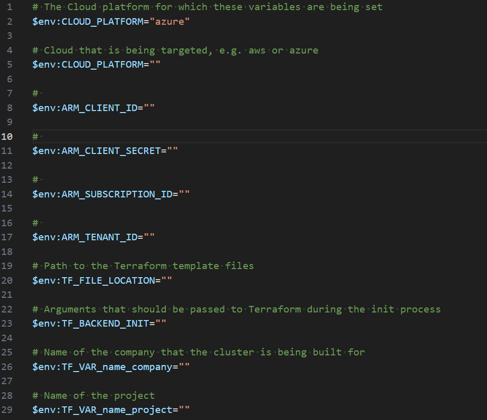

== Getting Started

One of the things with the Ensono Digital Independent Runner (EDIR) is that it is designed to make things easier for people to run things locally that will also be run by the CI/CD platform. That is all well and good, but not if it has not been used before. This section provides a quick overview of how to start off with the repo from scratch.

=== Prerequisites

Please ensure that the following prerequisites are satisfied:

* Docker Engine
** This can be Docker, Rancher Desktop or Podman
* Taskctl (https://github.com/russellseymour/taskctl/releases)

NOTE: Taskctl has been forked to add some new functionality to the tool that this repository uses.

=== Setup

In order to run the pipeline locally a number of environment variables are required. These are used to pass variable values to Terraform. The following table shows what these variables are. If you require more help running this module locally please look at the Terraform Repository and its associated README.md here ~> https://github.com/Ensono/terraform-azurerm-aci/blob/fca71851f529ba25708f594289bdd05778299021/README.md

[cols="1,2,1,1", options="header"]
|===
| Name | Description | Required | Example

| app_gateway_frontend_ip_name
| The name of the frontend IP configuration for the application gateway.
| yes
| myAppGatewayFrontendIP

| app_gateway_frontend_ip_rg
| The resource group of the application gateway frontend IP.
| yes
| myResourceGroup

| dns_a_record_name
| The name of the DNS A record.
| yes
| myDnsARecord

| dns_a_record_ttl
| The TTL (Time To Live) of the DNS A record in seconds.
| no
| 300

| dns_zone
| The DNS zone in which to create the A record.
| yes
| myDnsZone

| dns_zone_rg
| The resource group of the DNS zone.
| yes
| myDnsZoneResourceGroup

| location_name_map
| A map of Azure region names to custom short names.
| no
| { "northeurope": "eun", "westeurope": "euw", ... }

| name_company
| The name of the company.
| yes
| myCompany

| name_environment
| The environment name (e.g., production, staging).
| yes
| production

| name_project
| The project stack name.
| yes
| myProject

| name_domain
| The domain name.
| yes
| mydomain.com

| create_redis
| Flag to create a Redis instance.
| no
| true

| custom_name
| Provide a custom UNIQUE name for your cache instance. This overrides the name that is generated by the Claranet Redis module.
| no
| myCustomRedis

| attributes
| Additional attributes for the resources.
| no
| ["attr1", "attr2"]

| redis_resource_group_name
| The name of the resource group to deploy Redis to.
| yes
| myRedisResourceGroup

| location
| The region that your resources will deploy to.
| yes
| eastus

| logs_destinations_ids
| The list of destination IDs for logging.
| no
| ["/subscriptions/.../resourceGroups/..."]

| sku_name
| The SKU name for the Redis instance.
| no
| Basic

| capacity
| Redis size: (Basic/Standard: 1,2,3,4,5,6) (Premium: 1,2,3,4)
| no
| 1

| public_network_access_enabled
| Flag to enable public network access.
| no
| true

| allow_non_ssl_connections
| Flag to allow non-SSL connections.
| no
| true

| aof_backup_enabled
| Flag to enable AOF backup.
| no
| true

| aof_storage_connection_string_0
| Connection string for the first AOF storage.
| no
| DefaultEndpointsProtocol=https;AccountName=...

| aof_storage_connection_string_1
| Connection string for the second AOF storage.
| no
| DefaultEndpointsProtocol=https;AccountName=...

| enable_authentication
| Flag to enable authentication.
| no
| true

| active_directory_authentication_enabled
| Flag to enable Active Directory authentication.
| no
| true

| maxmemory_reserved
| Amount of memory reserved.
| no
| 512

| maxmemory_delta
| Amount of memory delta.
| no
| 256

| maxmemory_policy
| Memory eviction policy.
| no
| volatile-lru

| maxfragmentationmemory_reserved
| Amount of fragmentation memory reserved.
| no
| 512

| rdb_backup_enabled
| Flag to enable RDB backup.
| no
| true

| rdb_backup_frequency
| Frequency of RDB backups in minutes.
| no
| 60

| rdb_backup_max_snapshot_count
| Maximum number of RDB snapshots to keep.
| no
| 5

| rdb_storage_connection_string
| Connection string for RDB storage.
| no
| DefaultEndpointsProtocol=https;AccountName=...

| notify_keyspace_events
| Keyspace events to notify.
| no
| Ex
|===

==== PowerShell

If using PowerShell there is a cmdlet in the Ensono Stacks Independent Runner module that reads the `build/config/stage_envvars.yml` and creates a skeleton PowerShell script which will setup the variables.

[source,powershell,linenums]
---
New-EnvConfig -Path .\build\config\stage_envvars.yml -scriptPath local -Cloud Azure -Stage stacks-aci
---

The resultant script will be `local/envvar-azure-stacks-aci.ps1`. The naming convention is `envvar-<CLOUD>-<STAGE>.ps1`.

.Environment variable script

Edit this file as needed and then run the script `. ./local/envvar-azure-stacks-aci.ps1`. This will then setup the necessary environment variables in your local shell. These will then be copied into the container when it is spun up by Taskctl.

==== Bash

Currently we do not have an option when running in `bash` for creating such a script file. We have some ideas on how this will be done, but the biggest issue is how this will be distributed.

=== Running the Pipelines

Now that the environment has been configured the pipelines can be run.

[cols="1,4",options=header,stripes=even]
|===
| # | Command
| 1 | `taskctl lint`
| 2 | `taskctl infrastructure`
| 3 | `taskctl app`
| 4 | `taskctl tests`
| 5 | `taskctl docs`
|===

These pipelines can be run in any order based on the task that needs to be accomplished. In addition to these any of the tasks, as described in <<Pipeline>> can be executed.
