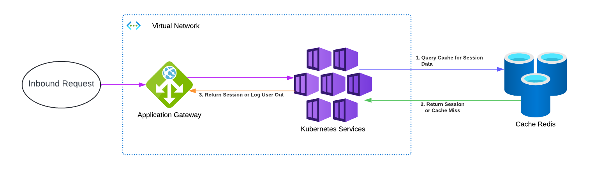

== Infrastructure

All of the infrastructure that is deployed to Azure, is done using Terraform. The templates have been configured so that different options can be deployed depending on requirements.

The following diagram depicts the resources that are deployed.

.Azure Resourses for the intended data flow for utilization of session managemenet within Azure Cache for Redis.

The deployment of the resources is performed using the Ensono Digital ACI module as found in the https://registry.terraform.io/modules/claranet/redis/azurerm/latest[claranet Redis Terraform] repository.

=== Terraform Inputs
[cols="1,2,1,1", options="header"]
|===
| Name | Description | Required | Example

| app_gateway_frontend_ip_name
| 
| yes
| myAppGatewayFrontendIP

| app_gateway_frontend_ip_rg
| 
| yes
| myResourceGroup

| dns_a_record_name
| 
| yes
| myDnsARecord

| dns_a_record_ttl
| 
| no
| 300

| dns_zone
| 
| yes
| myDnsZone

| dns_zone_rg
| 
| yes
| myDnsZoneResourceGroup

| location_name_map
| 
| no
| { "northeurope": "eun", "westeurope": "euw", ... }

| name_company
| The name of the company
| yes
| myCompany

| name_environment
| The environment name
| yes
| production

| name_project
| The project stack name
| yes
| myProject

| name_domain
| 
| yes
| mydomain.com

| create_redis
| 
| no
| true

| custom_name
| Provide a custom UNIQUE name for your cache instance. This overrides the name that is generated by the claranet redis module.
| no
| myCustomRedis

| attributes
| 
| no
| ["attr1", "attr2"]

| redis_resource_group_name
| The name of the resource group to deploy Redis to.
| yes
| myRedisResourceGroup

| location
| The region that your resources will deploy to.
| yes
| eastus

| logs_destinations_ids
| The list of destination IDs for logging.
| no
| ["/subscriptions/.../resourceGroups/..."]

| sku_name
| The SKU name for the Redis instance.
| no
| Basic

| capacity
| Redis size: (Basic/Standard: 1,2,3,4,5,6) (Premium: 1,2,3,4)
| no
| 1

| public_network_access_enabled
| Flag to enable public network access
| no
| true

| allow_non_ssl_connections
| Flag to allow non-SSL connections
| no
| true

| aof_backup_enabled
| Flag to enable AOF backup
| no
| true

| aof_storage_connection_string_0
| Connection string for the first AOF storage
| no
| DefaultEndpointsProtocol=https;AccountName=...

| aof_storage_connection_string_1
| Connection string for the second AOF storage
| no
| DefaultEndpointsProtocol=https;AccountName=...

| enable_authentication
| Flag to enable authentication
| no
| true

| active_directory_authentication_enabled
| Flag to enable Active Directory authentication
| no
| true

| maxmemory_reserved
| Amount of memory reserved
| no
| 512

| maxmemory_delta
| Amount of memory delta
| no
| 256

| maxmemory_policy
| Memory eviction policy
| no
| volatile-lru

| maxfragmentationmemory_reserved
| Amount of fragmentation memory reserved
| no
| 512

| rdb_backup_enabled
| Flag to enable RDB backup
| no
| true

| rdb_backup_frequency
| Frequency of RDB backups
| no
| 60

| rdb_backup_max_snapshot_count
| Maximum number of RDB snapshots to keep
| no
| 5

| rdb_storage_connection_string
| Connection string for RDB storage
| no
| DefaultEndpointsProtocol=https;AccountName=...

| notify_keyspace_events
| Keyspace events to notify
| no
| Ex
|===

=== Terraform Outputs

A number of outputs from Terraform are required in other parts of the pipeline, such as testing Infrastructure with InSpec.

A new PowerShell cmdlet has been created called `Set-EnvironmentVars` which allows any JSON string to be passed and for it to be interpreted and the name and value to be turned into environment variables. The option to pass the date through is also available so that a simple key value pair is passed along the pipeline.

The following code snippet shows how the outputs from Terraform can be turned into prefixed environment variables.

.Extracting Terraform outputs
[source,powershell,linenums]
----
# This command is run from the root of the repository
Invoke-Terraform -Output -Path deploy/terraform | `
    Set-EnvironmentVars -prefix "TFOUT" -key "value" -passthru | `
    ConvertTo-Yaml | `
    Out-File -Path inspec_inputs.yml
----

As can be seen from the example above, this command has four parts to the pipeline.

. Get the outputs from Terraform as a JSON string.
* Under the hood the `Invoke-Terraform` calls the Terraform command and retrieves the output as JSON
. Create environment variables from each of the names of the outputs in the JSON. Prefix these names with `TFOUT`. As the data from Terraform can be nested, the `-key` parameter informs the cmdlet which nested parameter holds the value. Also pass an array of data through the pipeline.
. Convert the array to a YAML string
. Write the the YAML string to a file to be used for the infrastructure tests
