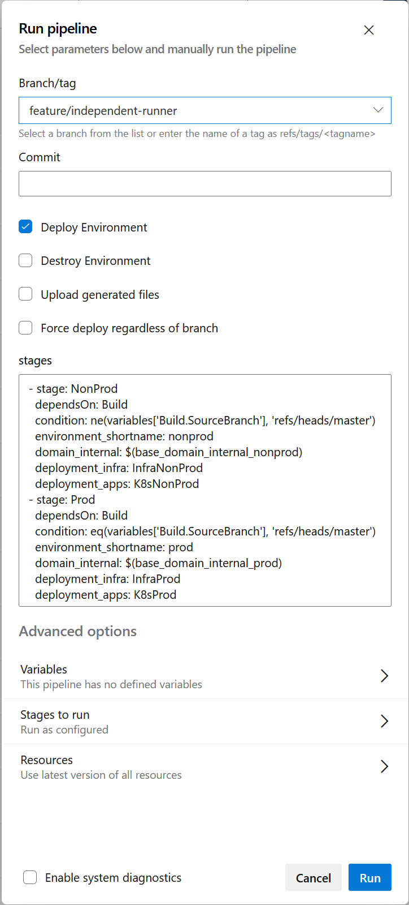

== Pipeline

There are two pipelines at work within the repository. The one that is run by the CI/CD platform and ones that are executed by the Ensono Digital Independent Runner (EDIR).

NOTE: The Independent Runner is the main pipeline that is executed, whether it is by a CI/CD platform or on a local machine. The CI/CD pipelines are shims that call the Independent Runner which ensures that the pipeline is executed the same way each time.

=== Independent Runner

The EDIR has a number of pipelines that run a number of tasks.

.EDIR Tasks
[cols="1,3",options="header",stripes=even]
|===
| Name | Description
| `build:number` | Update the build number in a pipeline.

Currently knows how to set the build number for Azure DevOps.
| `lint:yaml` | Perform YAML linting on the repository
| `lint:terraform:format` | Perform a Terraform format check
| `lint:terraform:validate` | Validate the Terraform templates
| `infra:init` | Initialise Terraform for the specified templates and backend
| `infra:plan` | Run the Terraform plan to create the plan file which will be used to modify the the resources
| `infra:apply` | Apply the actions as defined by the plan
| `infra:destroy:plan` | Create the plan for destroying the environment
| `infra:destroy:apply` | Perform the destruction of the environment as per the plan
| `infra:output` | Present the Terraform outputs as a JSON string
| `setup:dev` | Create a shell script which will configure the environment variables based on the `build/config/stage_envvars.yaml`
| `setup:environment` | Ensure that the environment is configured correctly. This can be used to ensure that all the necessary environment variables have been set.
| `app:build` | Builds a Docker Image for the associated Stacks-App
| `app:deploy` | Deploys associated Docker Image to AKS Cluster via K8s manifests, and updates the secret value to ensure redis connection string is exposed.
| `tests:infra:init` | Initialse the Inspec test profile. 
| `tests:infra:vendor` | This will analyse the profile and download the required providers to run the tests
| `tests:infra:run` | Execute infrastructure tests against the deployed Cloud Resources using Inspec
| `_docs` | Create a PDF file of the documentation.
| `_release` | Create a tag in the GitHub repo when the code is run on the main branch
|===

The tasks are defined in `build/taskctl/tasks.yaml`

.EDIR Pipelines
[cols="1,2,2a",options="header",stripes="even"]
|===
| Name | Description | Flowchart
| lint | Perform all the of the linting tasks for the project.
Yaml and Terraform.

All of the steps in the pipeline are run in parallel where possible. |
[graphviz]
----
include::diagrams/lint.dot[]
----
| tests | Perform infrastructure tests | 
[graphviz]
----
include::diagrams/tests.dot[]
----
| infrastructure | Run Terraform and deploy all of the necessary resources into the target cloud |
[graphviz]
----
include::diagrams/infrastructure.dot[]
----
| docs | Build the documentation |
[graphviz]
----
include::diagrams/documentation.dot[]
----
| app | Build and deploy Docker Image to AKS |
[graphviz]
----
include::diagrams/app.dot[]
----
| release | Runs all of the tasks to create a GitHub release |
[graphviz]
----
include::diagrams/release.dot[]
----
|===

=== Azure DevOps

The following diagram shows the stages and the jobs within each stage for Azure DevOps. Most of the time ADO will call upon the pipelines and tasks in EDIR, but where there is a task that needs to be performed that is specific to ADO a native task will be used.

When the pipeline is invoked there are a number of parameters that can be configured. The following table details what these parameters are.

.Pipeline parameters
[cols="1,1,1,4",options="header",stripes=even]
|===
| Parameter | ID | Default | Description
| Deploy Enviornment | `deploy` | `true` | Deploy the environment
| Destroy Environment | `destroy` | `false` | Destroy the environment. When used with the `deploy` parameter this rebuilds the environment by tearing it down and redeploying it.
| Upload Generated Files | `upload` | `false` | The pipeline generates files for Terraform to use. This option will upload these file as build artifacts so they can be checked for issues. Useful for debugging.
| Force Deploy | `force` | `false` | This option allows environments to be built when not on the correct branch. This means that the non-prod environment can be deployed from the main build.
| Stages | `stages` | | To reduce unnecessary duplication in the ADO pipeline the stages are a parameterised array.

This allows the stage to be iterated over for each of the necessary environments and pass in the required changes when necessary.

It is not expected that this parameter will be modified often, rather used for the iteration of the stages.
|===

These values can be set, either when running the pipeline from the ADO portal or on the command line.

[cols="1a,1a",frame=none,grid=none]
|===
| 
.Executing pipeline from the portal

|
.Executing pipeline run from command line
[source,bash]
----
az pipelines run \
    --name "ensono.stacks-infrastructure-aci (1)" \
    --branch feature/independent-runner \
    --output table \
    --parameters destroy=true
----
|===

These options allow environments to be managed from any branch if required. The following table shows what will happen for each of the `destroy`, `deploy` and `force` options.

.Truth table detailing actions that will be performed
[cols="1,1,1,4",options="header",stripes=even]
|===
| Deploy | Destroy | Force | Action
| `true` | `false` | `false` | Environment is deployed based on branch it is running from, e.g. trunk will deploy prod and non-trunk will deploy non-prod
| `true` | `true` | `false` | Will destroy the environment before rebuilding it
| `false` | `true` | `false` | Will destroy the environment associated with the branch
| `false` | `false` | `false` | No-op
| `true` | `false` | `true` | Non-prod and prod environments will both be deployed
| `true` | `true` | `true` | Rebuild all environments
| `false` | `true` | `true` | Destroy all environments
| `false` | `false` | `true` | No-op 
|===

.Azure DevOps Pipeline Flowchart
[graphviz]
----
include::diagrams/ado_pipeline.dot[]
----

The 4 boxes in the diagram depict the different stages in the pipeline. The cyan coloured boxes are the native tasks to ADO that are used to perform a task. All of the other tasks match up to tasks in the EDIR as describes above.
