# Data Model: ESLint v9 Flat Config Migration

**Feature**: 003-eslint-flat-config  
**Date**: 3 February 2026

## Overview

This document describes the data entities involved in the ESLint flat config
migration. The primary entities are configuration objects that define linting
rules, plugins, and settings.

## Entities

### 1. FlatConfigArray

The root-level ESLint configuration, exported from `eslint.config.mjs`.

**Description**: An array of configuration objects that ESLint processes
sequentially. Later objects override earlier ones for matching files.

**Attributes**: | Attribute | Type | Required | Description |
|-----------|------|----------|-------------| | configs | ConfigObject[] | Yes |
Array of configuration objects |

**Relationships**:

- Contains multiple ConfigObject instances
- May reference external plugin configs

---

### 2. ConfigObject

An individual configuration block within the flat config array.

**Description**: Defines rules, plugins, and settings for a specific set of
files.

**Attributes**: | Attribute | Type | Required | Description |
|-----------|------|----------|-------------| | name | string | No |
Human-readable identifier for debugging | | files | string[] | No | Glob
patterns for files this config applies to | | ignores | string[] | No | Glob
patterns for files to exclude | | languageOptions | LanguageOptions | No |
Parser and globals configuration | | linterOptions | LinterOptions | No |
Linting behavior configuration | | plugins | Record<string, Plugin> | No |
Plugin name to plugin object mapping | | rules | Record<string, RuleConfig> | No
| Rule name to severity/options mapping | | settings | Record<string, unknown> |
No | Shared settings for plugins | | processor | string \| Processor | No | File
processor configuration |

**Validation Rules**:

- If only `ignores` is present (no other keys except `name`), acts as global
  ignores
- `files` must be an array, not a single string
- Plugin names must match keys in `plugins` object

---

### 3. LanguageOptions

Configuration for how source code is parsed and interpreted.

**Attributes**: | Attribute | Type | Required | Description |
|-----------|------|----------|-------------| | ecmaVersion | number \| 'latest'
| No | ECMAScript version (default: 'latest') | | sourceType | 'module' \|
'script' \| 'commonjs' | No | Module system type | | globals | Record<string,
GlobalConfig> | No | Global variable definitions | | parser | Parser | No |
Custom parser (default: espree) | | parserOptions | Record<string, unknown> | No
| Parser-specific options |

**State Transitions**: N/A (static configuration)

---

### 4. PluginVersionMatrix

Mapping of ESLint plugins to their version requirements.

**Description**: Tracks plugin versions for package.json updates.

**Attributes**: | Plugin Name | Current Version | Target Version | Flat Config
Export | |-------------|-----------------|----------------|-------------------|
| eslint | ~8.57.0 | ^9.8.0 | N/A | | @typescript-eslint/eslint-plugin | 7.18.0
| ^8.0.0 | Via typescript-eslint | | @typescript-eslint/parser | 7.18.0 | ^8.0.0
| Via typescript-eslint | | typescript-eslint | N/A | ^8.0.0 |
tseslint.configs._ | | @nx/eslint-plugin | 22.4.4 | 22.4.4 | nxPlugin.configs._
| | eslint-plugin-import | 2.31.0 | 2.31.0 | importPlugin.flatConfigs._ | |
eslint-plugin-security | 3.0.1 | 3.0.1 | pluginSecurity.configs._ | |
eslint-plugin-unicorn | 56.0.1 | ^57.0.0 | unicornPlugin.configs['flat/*'] | |
eslint-plugin-prettier | 5.5.5 | 5.5.5 | eslintPluginPrettierRecommended | |
eslint-plugin-jest | - | ^28.0.0 | jest.configs['flat/*'] | |
eslint-plugin-testing-library | 6.2.2 | ^7.0.0 |
testingLibrary.configs['flat/*'] |

---

### 5. CoreEslintUtilities

Functions provided by `@ensono-stacks/core` for ESLint configuration
manipulation.

**Current Utilities (eslintrc format)**: | Function | Purpose | Status |
|----------|---------|--------| | updateEslintConfig | Read/modify
.eslintrc.json | Deprecate | | mergeEslintConfigs | Combine Linter.Config
objects | Deprecate | | formatFilesWithEslint | Run eslint --fix | Keep |

**New Utilities (flat config format)**: | Function | Purpose | Status |
|----------|---------|--------| | updateFlatEslintConfig | Read/modify
eslint.config.mjs | New | | mergeFlatConfigs | Combine flat config arrays | New
| | createFlatConfigBlock | Create ConfigObject from options | New | |
getFlatConfigPath | Resolve eslint.config.mjs location | New |

---

### 6. GeneratorEslintSchema

Schema options for ESLint configuration in generators.

**Workspace Init Generator**: | Option | Type | Default | Description |
|--------|------|---------|-------------| | eslint | boolean | true | Enable
ESLint configuration |

**Next Init Generator**: | Option | Type | Default | Description |
|--------|------|---------|-------------| | (implicit) | - | - | Always
configures ESLint for Next.js projects |

---

## File Mappings

### Before Migration (eslintrc format)

```
.eslintrc.json                           # Root config
packages/<name>/.eslintrc.json           # Project configs (11 files)
```

### After Migration (flat config format)

```
eslint.config.mjs                         # Root config (ESM)
packages/<name>/eslint.config.mjs         # Project configs (11 files, ESM)
```

## Configuration Inheritance

```mermaid
graph TD
    A[Root eslint.config.mjs] --> B[packages/azure-node/eslint.config.mjs]
    A --> C[packages/azure-react/eslint.config.mjs]
    A --> D[packages/common/core/eslint.config.mjs]
    A --> E[packages/common/e2e/eslint.config.mjs]
    A --> F[packages/common/test/eslint.config.mjs]
    A --> G[packages/create/eslint.config.mjs]
    A --> H[packages/logger/eslint.config.mjs]
    A --> I[packages/next/eslint.config.mjs]
    A --> J[packages/playwright/eslint.config.mjs]
    A --> K[packages/rest-client/eslint.config.mjs]
    A --> L[packages/workspace/eslint.config.mjs]
```



Each project config:

1. Imports and spreads the root config
2. Adds project-specific overrides
3. May configure additional plugins
